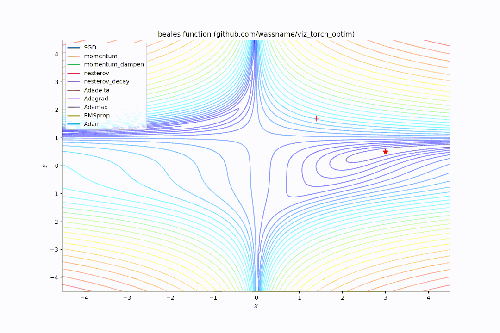
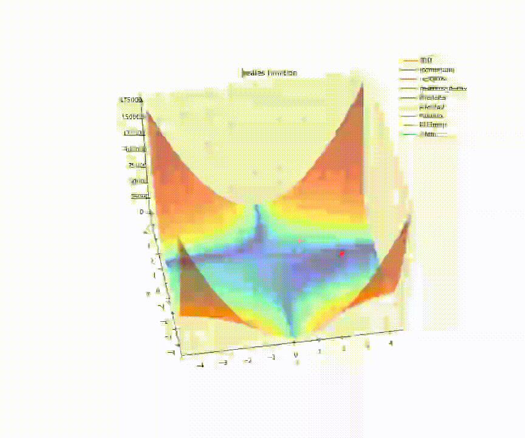
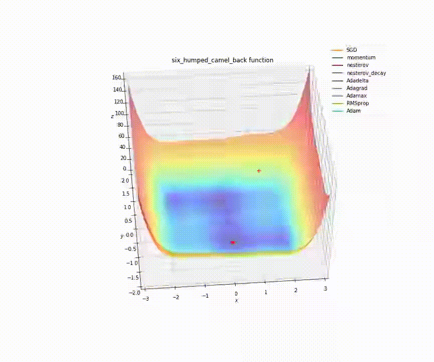
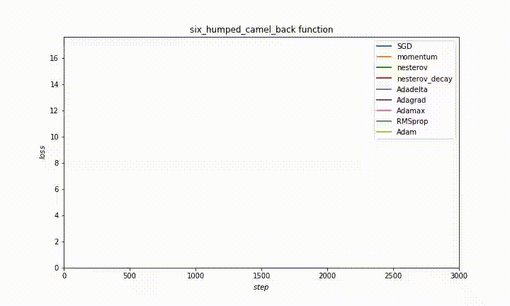
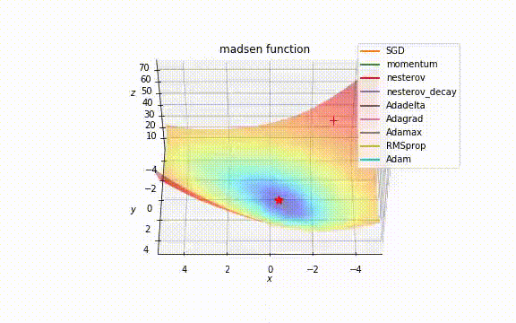
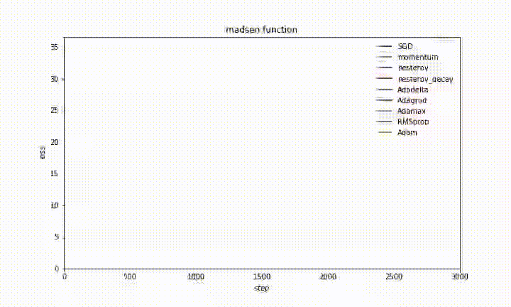
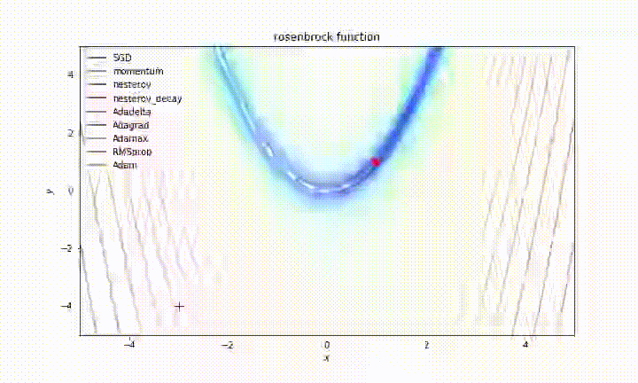

This project generates animations of pytorch optimizers solving toy problems. Examples Below.

[Some nice animations](http://www.denizyuret.com/2015/03/alec-radfords-animations-for.html) were posted a few years ago by Alex Radford but didn't include the Adam optimizer or landscapes with noise.  [Louis Tiao](http://louistiao.me/notes/visualizing-and-animating-optimization-algorithms-with-matplotlib/) blogged about how to make the visualizations. The [pytorch unit tests](https://github.com/pytorch/pytorch/blob/master/test/test_optim.py) show how to run the optimizers on test functions. I pulled these together and shared the result at https://github.com/wassname/viz_torch_optim. Please make some better animations and share them.

# Examples

Please note each optimizer has a differen't learning rate. This is because simpler optimizers perform better on low dimensional problems. So, with a constant learning rate, the simpler SGD optimizer races while Adam crawls along. In that case we would be able to see SGD's path or Adam's movement. So I used differen't learning rates for each optimizer in order to show them on the same video.

## With cyclic annealing:

## Constant learning rate

### Beales function

### Six humped camel function

### Madsen function

### Rosenbrock function

# Usage:

- `git clone https://github.com/wassname/viz_torch_optim`
- `jupyter notebook`
- open main.ipynb
- install any missing dependencies with pip
